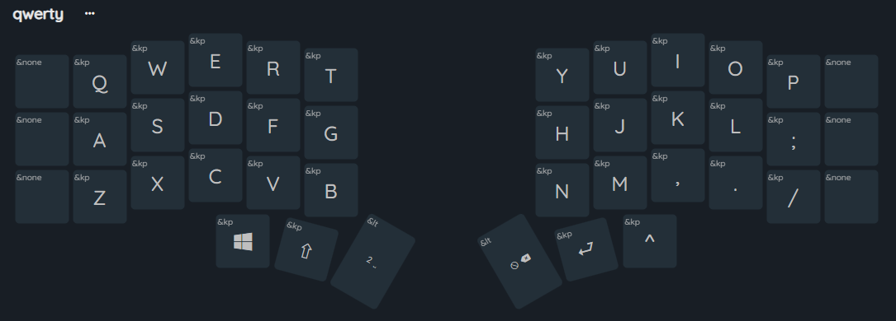
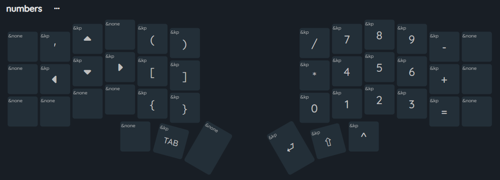
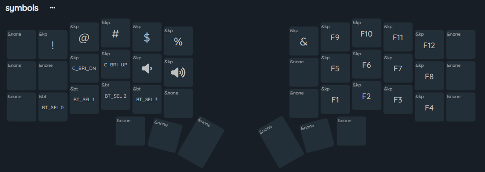

# Corne 5x3 Wireless ZMK Config

Custom configuration for Corne 5x3 wireless keyboard with QWERTY layout.

## Keymap Layers

### Base Layer (QWERTY)

The base layer uses the standard QWERTY layout optimized for a 42-key keyboard.

### Numbers Layer

This layer provides access to numbers organized as a numpad on the right side, mathematical symbols, parentheses, and navigation keys (arrows) on the left side.

### Symbols Layer

The symbols layer includes function keys (F1-F12), special characters, media controls (volume and brightness), and Bluetooth settings.

## Features

- QWERTY 5x3 layout 
- Numpad organized on the right side
- F-keys and symbols on secondary layers
- Independent Bluetooth reset for each side
- Media controls (volume and brightness)
- Optimized for Windows

## Special Features

- **CTRL accessible on NUM layer:** Last position of thumb keys
- **SHIFT and TAB on NUM layer:** For numeric combinations
- **Dedicated numpad:** Right side with traditional layout
- **Navigation:** Arrow keys on the left side of NUM layer
- **Complete F-keys:** F1-F12 on SYM layer
- **Symbols and parentheses:** Organized on NUM layer (left side)
- **Media controls:** Volume and brightness on SYM layer

## How to Use

1. Download the compiled .uf2 files from GitHub Actions
2. Connect the keyboard in bootloader mode
3. Copy the corresponding .uf2 file to each side
4. First time: pair via Bluetooth (will be reset automatically on future updates)

## Special Settings

- **Bluetooth Priority**: Always connects via Bluetooth by default
- **Automatic Reset**: Clears BT settings when updating firmware

## Configured Combos

- **ESC**: Q + W
- **CTRL**: Z + X  
- **HOME**: Y + U
- **END**: H + J
- **Windows + Tab**: E + R + T
- **Bluetooth Reset (Left)**: Q + W + E + R
- **Bluetooth Reset (Right)**: P + O + I + U
- **Toggle USB/Bluetooth**: A + S + D